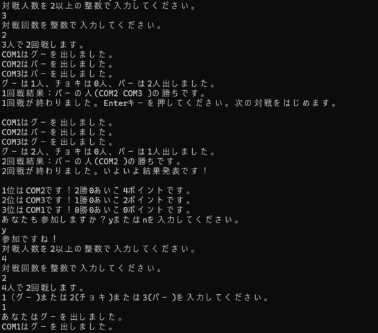
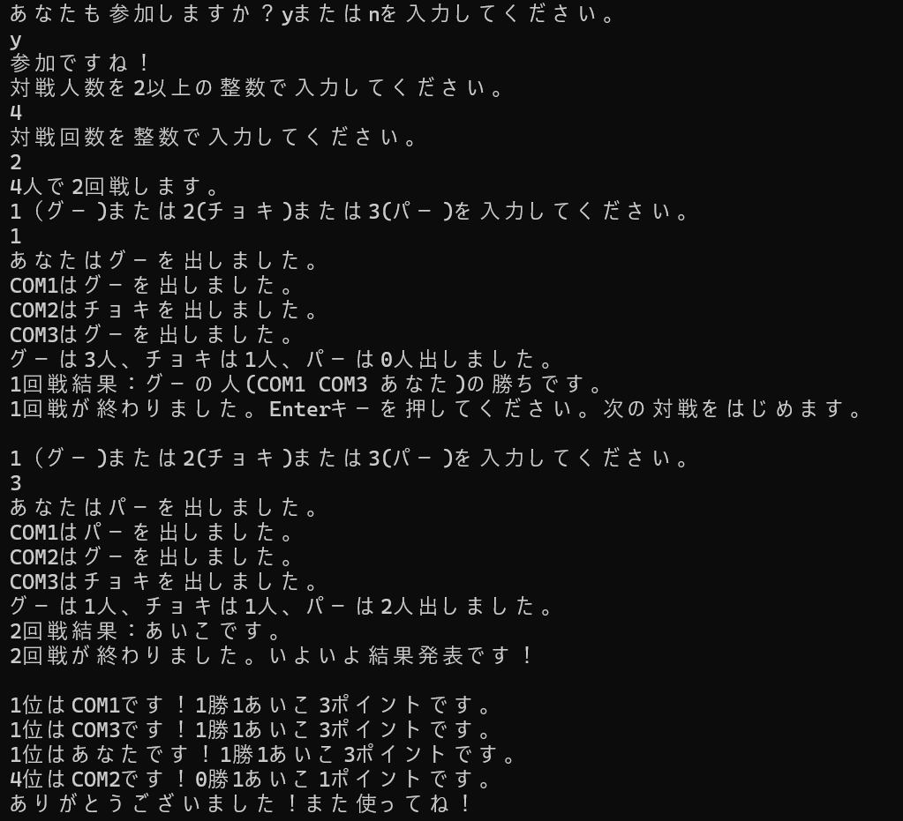

# じゃんけんプログラム

Javaの基本学習として作成した、 
コマンドプロンプト上で動くじゃんけんゲームです。

[概要](#概要)
[できる事](#できる事)
[使用技術・環境](#使用技術・環境)
[実行イメージ](#実行イメージ)
[工夫した点](#工夫した点)
[苦労した点・学んだこと](#苦労した点・学んだこと)
[その他](#その他)
 

## 概要 
・Java学習開始約３週間後に作成したプログラムです。 
・基本文法と処理の流れの理解を目的として作成した、 
　コマンドプロンプト上で動作するじゃんけんゲームです。 
・ネットで調べたり、人に聞く事は禁止としました。（テキストはOK） 

## できる事　（２パターン） 
① コンピュータ同士のじゃんけん 

1. キーボードで対戦人数と、対戦回数を入力。 
1. ランダムで、コンピュータ同士でじゃんけんを行う。 
1. 出し手表示、集計。結果を表示。 
1. 対戦が終わったら、Enterキーを押して、次の対戦へ 
1. 対戦回数が終わるまで繰り返し。 
1. 結果発表！ 

② コンピュータと"自分"とのじゃんけん 
1. 自分も参加するかどうかキーボード入力。 
1. 参加する場合、出し手を入力。 
1. 出し手表示、集計。結果を表示。 
1. 流れは①と同じ。 

## 使用技術・環境 
・言語：Java 
・実行環境：コ ンドプロンプト 
・使用技術： 
　BufferedReaderによるキーボード入力 
　Math.randomによる乱数生成 
　if文 
　for文 
　配列 

## 実行イメージ 
  
 

 
## 工夫した点 
・ゲームらしくするために、 
　人数と対戦回数を入力により指定できるようにしました。 
　固定値ではなく、入力により動作が変わる処理を実装することで、 
　条件分岐や繰り返し処理の理解を深めることを意識しました。 
　→変数に数値を入れて、配列準備・繰り返し。 
 
・結果を集計できるようにしました。 
　→対戦結果をまとめて扱えるようにするために、 
　　配列を準備し、そこにポイントを格納、 
　　点数の高い順に並べ替える処理を実装しました。 

・実装したい機能が多数あるため、 
　処理の見通しを良くする目的で、 
　機能ごとに処理をクリアしていきました。 

## 苦労した点・学んだこと 
・機能が増えてくるにつれて、 
　それまでの記述ではうまくいかない部分もあったり、 
　修正したりしないといけないこともありました。 

・エラー発生時に見直して失敗しやすいパターンも 
　だんだんと把握できるようになってきました。 
 
・初めの頃は、エラーが出ると「イヤだな」と思っていても、 
　次第に慣れてきてエラーが出るのは当たり前、 
　むしろエラーがなくなった時の達成感が増してきました。 

・初めに機能や記述の流れを項目ごとに分けたのは、 
　良かったと思います。  

## その他 
・作成後、内容を整理してプレゼンテーションを行い、 
　処理の流れや工夫点を他者に説明しました。
